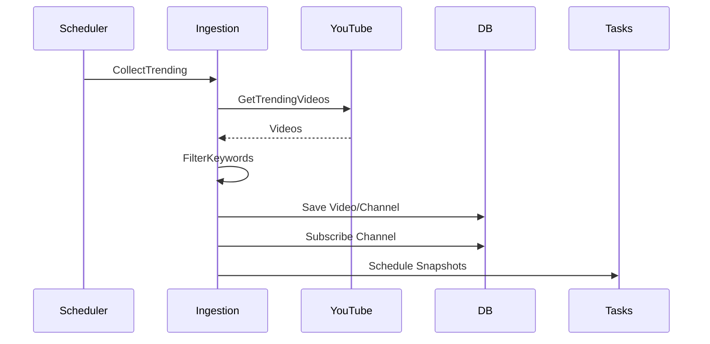
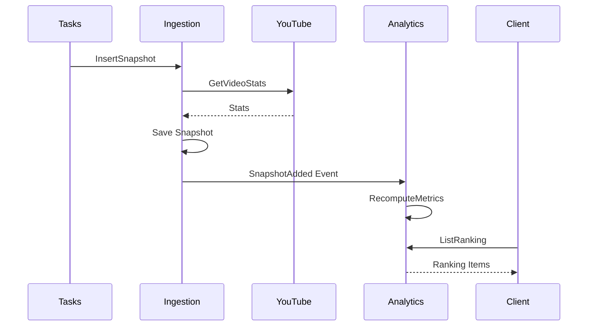
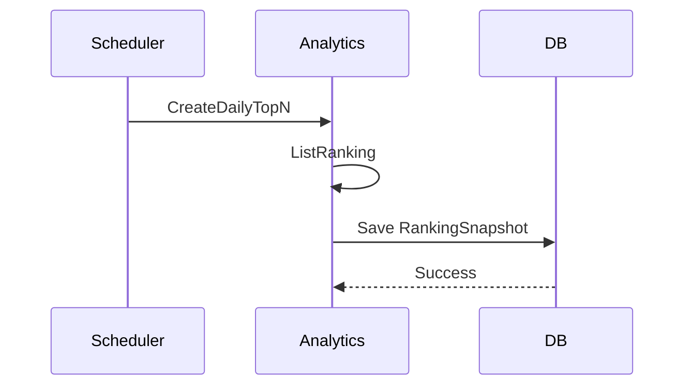

# Application Services (Use Case Executors)

Service layer that executes use cases and orchestrates domain models.

## Ingestion Application Services

### KeywordUseCase (Filter Keyword Management)

#### Purpose
CRUD operations for filter keywords (include/exclude rules)

#### Operations
- `ListKeywords`: List all keywords including enabled/disabled
- `CreateKeyword`: Register new keyword with name/filterType, auto-generate pattern
- `UpdateKeyword`: Update keyword name or description, regenerate pattern
- `EnableKeyword`/`DisableKeyword`: Toggle keyword activation
- `DeleteKeyword`: Soft delete (set deleted_at)

### ChannelUseCase (Channel Subscription Management)

#### Purpose
Manage monitored channels and WebSub subscription renewals

#### Operations
- `SubscribeChannel`: Add channel to monitoring (subscribed=true, request WebSub)
- `UnsubscribeChannel`: Remove channel from monitoring
- `RenewSubscriptions`: Periodically renew WebSub subscriptions for all subscribed channels
- `ListChannels`: List channels with filtering (subscribed/all/search)

### VideoUseCase (Video Monitoring & Snapshots)

#### Purpose
Register new videos and save checkpoint snapshots

#### Operations
- `RegisterFromTrending`: Apply keyword filter to trending videos, register matches
- `ApplyWebSubNotification`: Process hub notification → save D0 → schedule +3/6/12/24/48/72/168h
- `AddSnapshot`: Called by Cloud Tasks, fetch YouTube stats and save (idempotent)

### SystemUseCase (System Operations)

#### Purpose
Internal operations triggered by external events

#### Operations
- `CollectTrending`: Cron job to fetch region=JP, category=27/28 trending videos
- `HealthCheck`: WebSub hub.challenge verification endpoint
- `Warm`: Dummy endpoint for Cloud Scheduler keep-alive

## Implementation Details

### CollectTrending (System Use Case)

#### Purpose
Collect trending videos from specified categories and register/subscribe after filter evaluation

#### Implementation
```go
type CollectTrendingUseCase struct {
    youtubeClient  YouTubeClient
    videoRepo      VideoRepository
    channelRepo    ChannelRepository
    keywordRepo    FilterKeywordRepository
    filterService  FilterService
    taskClient     TaskClient
}

func (uc *CollectTrendingUseCase) Execute(
    ctx context.Context,
    categories []int, // [27, 28]
    pages int,        // number of pages to retrieve
) error {
    // 1. Get keyword filters
    keywords, err := uc.keywordRepo.FindEnabled(ctx)
    if err != nil {
        return err
    }
    
    stats := CollectStats{}
    
    for _, category := range categories {
        // 2. Get trending videos from YouTube API
        videos, err := uc.youtubeClient.GetTrendingVideos(
            ctx, category, pages,
        )
        if err != nil {
            return err
        }
        
        for _, video := range videos {
            // 3. Filter evaluation
            result := uc.filterService.Filter(
                video.Title, keywords,
            )
            
            switch result {
            case FilterResultExclude:
                stats.Excluded++
                continue
                
            case FilterResultInclude:
                stats.Included++
                // 4. Register video and channel
                if err := uc.registerVideo(ctx, video); err != nil {
                    return err
                }
                
            case FilterResultNeutral:
                stats.Neutral++
                // Skip
            }
        }
    }
    
    log.Printf("Collect completed: %+v", stats)
    return nil
}

func (uc *CollectTrendingUseCase) registerVideo(
    ctx context.Context,
    video YouTubeVideo,
) error {
    // Create channel if not registered
    channel, err := uc.channelRepo.FindByID(ctx, video.ChannelID)
    if err == ErrNotFound {
        channel = &Channel{
            ID:    video.ChannelID,
            Title: video.ChannelTitle,
        }
        if err := uc.channelRepo.Create(ctx, channel); err != nil {
            return err
        }
    }
    
    // Subscribe to channel (if not subscribed)
    if !channel.Subscribed {
        if err := uc.subscribeChannel(ctx, channel.ID); err != nil {
            log.Printf("Failed to subscribe: %v", err)
        }
    }
    
    // Register video
    v := &Video{
        ID:          video.ID,
        ChannelID:   video.ChannelID,
        Title:       video.Title,
        PublishedAt: video.PublishedAt,
    }
    if err := uc.videoRepo.Create(ctx, v); err != nil {
        if !IsAlreadyExists(err) {
            return err
        }
    }
    
    // D0 snapshot retrieval and task scheduling
    return uc.scheduleInitialSnapshot(ctx, video.ID)
}
```

### ApplyWebSub (WebSub Notification Processing)

#### Purpose
Process new video notifications to save D0 and schedule subsequent snapshots

#### Implementation
```go
type ApplyWebSubUseCase struct {
    youtubeClient YouTubeClient
    videoRepo     VideoRepository
    snapshotRepo  VideoSnapshotRepository
    taskClient    TaskClient
    taskIDGen     TaskIDGenerator
}

func (uc *ApplyWebSubUseCase) Execute(
    ctx context.Context,
    videoID string,
) error {
    // 1. Get from YouTube API if video is not registered
    video, err := uc.videoRepo.FindByID(ctx, videoID)
    if err == ErrNotFound {
        ytVideo, err := uc.youtubeClient.GetVideo(ctx, videoID)
        if err != nil {
            return err
        }
        
        video = &Video{
            ID:          ytVideo.ID,
            ChannelID:   ytVideo.ChannelID,
            Title:       ytVideo.Title,
            PublishedAt: ytVideo.PublishedAt,
        }
        
        if err := uc.videoRepo.Create(ctx, video); err != nil {
            return err
        }
    }
    
    // 2. Save D0 (0-hour point) snapshot
    stats, err := uc.youtubeClient.GetVideoStats(ctx, videoID)
    if err != nil {
        return err
    }
    
    channelStats, err := uc.youtubeClient.GetChannelStats(
        ctx, video.ChannelID,
    )
    if err != nil {
        return err
    }
    
    snapshot := &VideoSnapshot{
        VideoID:          videoID,
        CheckpointHour:   0,
        MeasuredAt:       time.Now(),
        ViewsCount:       stats.ViewCount,
        LikesCount:       stats.LikeCount,
        SubscriptionCount: channelStats.SubscriberCount,
        Source:           "websub",
    }
    
    if err := uc.snapshotRepo.Create(ctx, snapshot); err != nil {
        if !IsAlreadyExists(err) {
            return err
        }
    }
    
    // 3. Schedule subsequent snapshots
    checkpoints := []int{3, 6, 12, 24, 48, 72, 168}
    publishedAt := video.PublishedAt
    
    for _, cp := range checkpoints {
        eta := publishedAt.Add(time.Duration(cp) * time.Hour)
        
        if eta.Before(time.Now()) {
            // Skip if already in the past
            continue
        }
        
        taskID := uc.taskIDGen.GenerateSnapshotTaskID(videoID, cp)
        
        task := &Task{
            ID:      taskID,
            Type:    "snapshot",
            Payload: map[string]interface{}{
                "video_id":        videoID,
                "checkpoint_hour": cp,
            },
            ScheduledFor: eta,
        }
        
        if err := uc.taskClient.Schedule(ctx, task); err != nil {
            log.Printf("Failed to schedule task: %v", err)
        }
    }
    
    return nil
}
```

## Analytics Application Services

#### Purpose
Retrieve and save actual measurements when ETA arrives, trigger metrics recalculation

#### Implementation
```go
type InsertSnapshotUseCase struct {
    youtubeClient  YouTubeClient
    videoRepo      VideoRepository
    snapshotRepo   VideoSnapshotRepository
    eventPublisher EventPublisher
}

func (uc *InsertSnapshotUseCase) Execute(
    ctx context.Context,
    videoID string,
    checkpointHour int,
) error {
    // 1. Check existing (idempotency)
    existing, _ := uc.snapshotRepo.FindByVideoAndCP(
        ctx, videoID, checkpointHour,
    )
    if existing != nil {
        log.Printf("Snapshot already exists: %s@%dh", 
            videoID, checkpointHour)
        return nil
    }
    
    // 2. Get latest data from YouTube API
    stats, err := uc.youtubeClient.GetVideoStats(ctx, videoID)
    if err != nil {
        return err
    }
    
    video, err := uc.videoRepo.FindByID(ctx, videoID)
    if err != nil {
        return err
    }
    
    channelStats, err := uc.youtubeClient.GetChannelStats(
        ctx, video.ChannelID,
    )
    if err != nil {
        return err
    }
    
    // 3. Save snapshot
    snapshot := &VideoSnapshot{
        VideoID:          videoID,
        CheckpointHour:   checkpointHour,
        MeasuredAt:       time.Now(),
        ViewsCount:       stats.ViewCount,
        LikesCount:       stats.LikeCount,
        SubscriptionCount: channelStats.SubscriberCount,
        Source:           "task",
    }
    
    if err := uc.snapshotRepo.Create(ctx, snapshot); err != nil {
        return err
    }
    
    // 4. Publish event (notify Analytics)
    event := SnapshotAddedEvent{
        VideoID:        videoID,
        CheckpointHour: checkpointHour,
        MeasuredAt:     snapshot.MeasuredAt,
    }
    
    return uc.eventPublisher.Publish(ctx, event)
}
```

### InsertSnapshot (Video Use Case)

#### Purpose
Retrieve and save actual measurements when checkpoint time arrives

### Triggers by Source

#### Human/Admin Operations (UI/CLI)
- ListKeywords, CreateKeyword, UpdateKeyword, Enable/Disable/DeleteKeyword
- Subscribe/UnsubscribeChannel, ListChannels

#### External Events
- WebSub hub.challenge → HealthCheck
- WebSub notification(videoId) → ApplyWebSubNotification

#### Scheduler/Tasks
- Cloud Scheduler → CollectTrending, RenewSubscriptions, Warm
- Cloud Tasks → AddSnapshot

## Implementation Examples

### KeywordUseCase Implementation
```go
type KeywordUseCase struct {
    keywordRepo    KeywordRepository
    patternBuilder PatternBuilder
}

// List all keywords
func (uc *KeywordUseCase) ListKeywords(
    ctx context.Context,
) ([]*Keyword, error) {
    return uc.keywordRepo.FindAll(ctx)
}

// Create new keyword
func (uc *KeywordUseCase) CreateKeyword(
    ctx context.Context,
    name string,
    filterType FilterType,
    description string,
) (*Keyword, error) {
    pattern, err := uc.patternBuilder.BuildPattern(name)
    if err != nil {
        return nil, err
    }
    
    keyword := &Keyword{
        ID:          uuid.New(),
        Name:        name,
        FilterType:  filterType,
        Pattern:     pattern,
        Description: description,
        Enabled:     true,
    }
    
    return keyword, uc.keywordRepo.Save(ctx, keyword)
}
```

### InsertSnapshot Implementation
```go
type InsertSnapshotUseCase struct {
    youtubeClient  YouTubeClient
    videoRepo      VideoRepository
    snapshotRepo   VideoSnapshotRepository
    eventPublisher EventPublisher
}

func (uc *InsertSnapshotUseCase) Execute(
    ctx context.Context,
    videoID string,
    checkpointHour int,
) error {
    // 1. Check existing (idempotency)
    existing, _ := uc.snapshotRepo.FindByVideoAndCP(
        ctx, videoID, checkpointHour,
    )
    if existing != nil {
        log.Printf("Snapshot already exists: %s@%dh", 
            videoID, checkpointHour)
        return nil
    }
    
    // 2. Get latest data from YouTube API
    stats, err := uc.youtubeClient.GetVideoStats(ctx, videoID)
    if err != nil {
        return err
    }
    
    video, err := uc.videoRepo.FindByID(ctx, videoID)
    if err != nil {
        return err
    }
    
    channelStats, err := uc.youtubeClient.GetChannelStats(
        ctx, video.ChannelID,
    )
    if err != nil {
        return err
    }
    
    // 3. Save snapshot
    snapshot := &VideoSnapshot{
        VideoID:          videoID,
        CheckpointHour:   checkpointHour,
        MeasuredAt:       time.Now(),
        ViewsCount:       stats.ViewCount,
        LikesCount:       stats.LikeCount,
        SubscriptionCount: channelStats.SubscriberCount,
        Source:           "task",
    }
    
    if err := uc.snapshotRepo.Create(ctx, snapshot); err != nil {
        return err
    }
    
    // 4. Publish event (notify Analytics)
    event := SnapshotAddedEvent{
        VideoID:        videoID,
        CheckpointHour: checkpointHour,
        MeasuredAt:     snapshot.MeasuredAt,
    }
    
    return uc.eventPublisher.Publish(ctx, event)
}
```

## Authority Application Services (MVP)

### GetAccount
- Purpose: Return current account profile (auth via interceptor)
- Ports: port/output/gateway.ClaimsProvider, port/output/gateway.AccountRepository, port/output/presenter.AuthorityPresenter
- Flow: ClaimsProvider.Current(ctx) → FindByEmail or FindByProvider → PresentGetAccount

### SignUp
- Purpose: Register account via identity provider (email/password)
- Ports: port/output/gateway.IdentityProvider, port/output/gateway.AccountRepository, port/output/presenter.AuthorityPresenter
- Flow: IDP.SignUp(email,password) → Create Account if missing (role=user, link password identity) → Save → PresentSignUp(tokens)

### SignIn
- Purpose: Authenticate via identity provider (email/password)
- Ports: port/output/gateway.IdentityProvider, port/output/gateway.AccountRepository, port/output/gateway.Clock, port/output/presenter.AuthorityPresenter
- Flow: IDP.SignIn(email,password) → If account exists TouchLogin(now) → Save → PresentSignIn(tokens)

### SignOut
- Purpose: Revoke refresh token
- Ports: port/output/gateway.IdentityProvider, port/output/presenter.AuthorityPresenter
- Flow: IDP.SignOut(refreshToken) → PresentSignOut

### ResetPassword
- Purpose: Send reset email via identity provider
- Ports: port/output/gateway.IdentityProvider, port/output/presenter.AuthorityPresenter
- Flow: IDP.ResetPassword(email) → PresentResetPassword

## Analytics Application Services

### RecomputeMetrics (Metrics Recalculation)

#### Purpose
Calculate and save various metrics from snapshots

#### Implementation
```go
type RecomputeMetricsUseCase struct {
    snapshotRepo      VideoSnapshotRepository
    metricsRepo       VideoMetricsRepository
    metricsCalculator MetricsCalculator
    exclusionPolicy   ExclusionPolicy
}

func (uc *RecomputeMetricsUseCase) Execute(
    ctx context.Context,
    videoID string,
    checkpointHour int,
) error {
    // 1. Get 0-point and X-point snapshots
    snapshot0, err := uc.snapshotRepo.FindByVideoAndCP(
        ctx, videoID, 0,
    )
    if err != nil {
        return fmt.Errorf("D0 not found: %v", err)
    }
    
    snapshotX, err := uc.snapshotRepo.FindByVideoAndCP(
        ctx, videoID, checkpointHour,
    )
    if err != nil {
        return fmt.Errorf("D%d not found: %v", checkpointHour, err)
    }
    
    // 2. Calculate various metrics
    metrics := &VideoMetrics{
        VideoID:        videoID,
        CheckpointHour: checkpointHour,
        PublishedAt:    snapshot0.MeasuredAt,
        
        // X-point values
        ViewsCount:        snapshotX.ViewsCount,
        LikesCount:        snapshotX.LikesCount,
        SubscriptionCount: snapshotX.SubscriptionCount,
        
        // 0-point values
        ViewsBaseline:        snapshot0.ViewsCount,
        LikesBaseline:        snapshot0.LikesCount,
        SubscriptionBaseline: snapshot0.SubscriptionCount,
    }
    
    // Growth rate
    metrics.ViewGrowthRatePerHour = uc.metricsCalculator.Growth(
        snapshotX.ViewsCount,
        snapshot0.ViewsCount,
        checkpointHour,
    )
    
    metrics.LikeGrowthRatePerHour = uc.metricsCalculator.Growth(
        snapshotX.LikesCount,
        snapshot0.LikesCount,
        checkpointHour,
    )
    
    // Engagement level
    metrics.ViewsPerSubscriptionRate = uc.metricsCalculator.ViewsPerSub(
        snapshotX.ViewsCount,
        snapshotX.SubscriptionCount,
    )
    
    // Quality (Wilson lower bound)
    metrics.WilsonLikeRateLowerBound = uc.metricsCalculator.WilsonLowerBound(
        snapshotX.LikesCount,
        snapshotX.ViewsCount,
    )
    
    // Heat level (LPS)
    metrics.LikesPerSubscriptionShrunkRate = uc.metricsCalculator.LpsShrunk(
        snapshotX.LikesCount,
        snapshotX.SubscriptionCount,
    )
    
    // 3. Exclusion judgment
    metrics.ExcludeFromRanking = uc.exclusionPolicy.ShouldExclude(
        checkpointHour,
        snapshotX.ViewsCount,
        snapshotX.SubscriptionCount,
    )
    
    // 4. Save (UPSERT)
    return uc.metricsRepo.Upsert(ctx, metrics)
}
```

### ListRanking (Ranking Retrieval)

#### Purpose
Return rankings according to conditions

#### Implementation
```go
type ListRankingUseCase struct {
    metricsRepo VideoMetricsRepository
    videoRepo   VideoRepository
}

type RankingQuery struct {
    PublishedFrom  time.Time
    PublishedTo    time.Time
    CheckpointHour int
    RankingKind    RankingKind
    HideLowSample  bool
    Category       *int
    Limit          int
    Offset         int
}

func (uc *ListRankingUseCase) Execute(
    ctx context.Context,
    query RankingQuery,
) ([]*RankingItem, error) {
    // 1. Search metrics by conditions
    metrics, err := uc.metricsRepo.FindByConditions(ctx, MetricsQuery{
        PublishedFrom:  query.PublishedFrom,
        PublishedTo:    query.PublishedTo,
        CheckpointHour: query.CheckpointHour,
        ExcludeRanking: query.HideLowSample,
        Category:       query.Category,
    })
    if err != nil {
        return nil, err
    }
    
    // 2. Sort by metric
    sortField := uc.getSortField(query.RankingKind)
    sort.Slice(metrics, func(i, j int) bool {
        return uc.getMetricValue(metrics[i], sortField) > 
               uc.getMetricValue(metrics[j], sortField)
    })
    
    // 3. Pagination
    start := query.Offset
    end := query.Offset + query.Limit
    if end > len(metrics) {
        end = len(metrics)
    }
    
    // 4. Convert to RankingItem
    result := make([]*RankingItem, 0, end-start)
    
    for i := start; i < end; i++ {
        m := metrics[i]
        
        video, err := uc.videoRepo.FindByID(ctx, m.VideoID)
        if err != nil {
            continue
        }
        
        item := &RankingItem{
            VideoID:        m.VideoID,
            Title:          video.Title,
            ChannelID:      video.ChannelID,
            ThumbnailURL:   video.ThumbnailURL,
            VideoURL:       video.VideoURL,
            PublishedAt:    video.PublishedAt,
            CheckpointHour: m.CheckpointHour,
            MainMetric:     uc.getMetricValue(m, sortField),
            ViewsCount:     m.ViewsCount,
            LikesCount:     m.LikesCount,
        }
        
        result = append(result, item)
    }
    
    return result, nil
}

func (uc *ListRankingUseCase) getSortField(
    kind RankingKind,
) string {
    switch kind {
    case RankingKindSpeedViews:
        return "ViewGrowthRatePerHour"
    case RankingKindSpeedLikes:
        return "LikeGrowthRatePerHour"
    case RankingKindRelativeViews:
        return "ViewsPerSubscriptionRate"
    case RankingKindQuality:
        return "WilsonLikeRateLowerBound"
    case RankingKindHeat:
        return "LikesPerSubscriptionShrunkRate"
    default:
        return "ViewGrowthRatePerHour"
    }
}
```

### CreateDailyTopN (History Preservation)

#### Purpose
Save ranking top N as snapshots under specified conditions

#### Implementation
```go
type CreateDailyTopNUseCase struct {
    listRankingUC ListRankingUseCase
    snapshotRepo  RankingSnapshotRepository
}

func (uc *CreateDailyTopNUseCase) Execute(
    ctx context.Context,
    rankingKind RankingKind,
    checkpointHour int,
    publishedRange DateRange,
    topN int,
) error {
    // 1. Get current ranking
    items, err := uc.listRankingUC.Execute(ctx, RankingQuery{
        PublishedFrom:  publishedRange.From,
        PublishedTo:    publishedRange.To,
        CheckpointHour: checkpointHour,
        RankingKind:    rankingKind,
        HideLowSample:  true,
        Limit:          topN,
        Offset:         0,
    })
    if err != nil {
        return err
    }
    
    // 2. Create snapshot
    snapshot := &RankingSnapshot{
        ID:             uuid.New(),
        SnapshotAt:     time.Now(),
        RankingKind:    rankingKind,
        CheckpointHour: checkpointHour,
        PublishedFrom:  publishedRange.From,
        PublishedTo:    publishedRange.To,
        TopN:           topN,
        Items:          make([]*RankingSnapshotItem, 0, len(items)),
    }
    
    // 3. Save each item
    for i, item := range items {
        snapshotItem := &RankingSnapshotItem{
            Rank:         i + 1,
            VideoID:      item.VideoID,
            Title:        item.Title,
            PublishedAt:  item.PublishedAt,
            MainMetric:   item.MainMetric,
            ViewsCount:   item.ViewsCount,
            LikesCount:   item.LikesCount,
            ThumbnailURL: item.ThumbnailURL,
            VideoURL:     item.VideoURL,
        }
        snapshot.Items = append(snapshot.Items, snapshotItem)
    }
    
    // 4. Save
    return uc.snapshotRepo.Create(ctx, snapshot)
}
```

## Authority Application Services

### GetMe (Profile Retrieval)

#### Purpose
Return authenticated user's profile and linked provider information

#### Implementation
```go
type GetMeUseCase struct {
    accountRepo  AccountRepository
    identityRepo IdentityRepository
}

func (uc *GetMeUseCase) Execute(
    ctx context.Context,
    userID string, // User ID retrieved from JWT
) (*AccountProfile, error) {
    // 1. Get account information
    account, err := uc.accountRepo.FindByID(ctx, userID)
    if err != nil {
        return nil, err
    }
    
    // 2. Get linked provider information
    identities, err := uc.identityRepo.FindByAccountID(
        ctx, account.ID,
    )
    if err != nil {
        return nil, err
    }
    
    // 3. Build response
    profile := &AccountProfile{
        ID:            account.ID,
        Email:         account.Email,
        EmailVerified: account.EmailVerified,
        DisplayName:   account.DisplayName,
        PhotoURL:      account.PhotoURL,
        Identities:    make([]IdentityInfo, 0, len(identities)),
    }
    
    for _, identity := range identities {
        info := IdentityInfo{
            Provider:    identity.Provider,
            ProviderUID: identity.ProviderUID,
        }
        profile.Identities = append(profile.Identities, info)
    }
    
    return profile, nil
}
```

## Representative Flows

### Collection → Tracking


### Measurement → Calculation → Provision


### History Preservation

