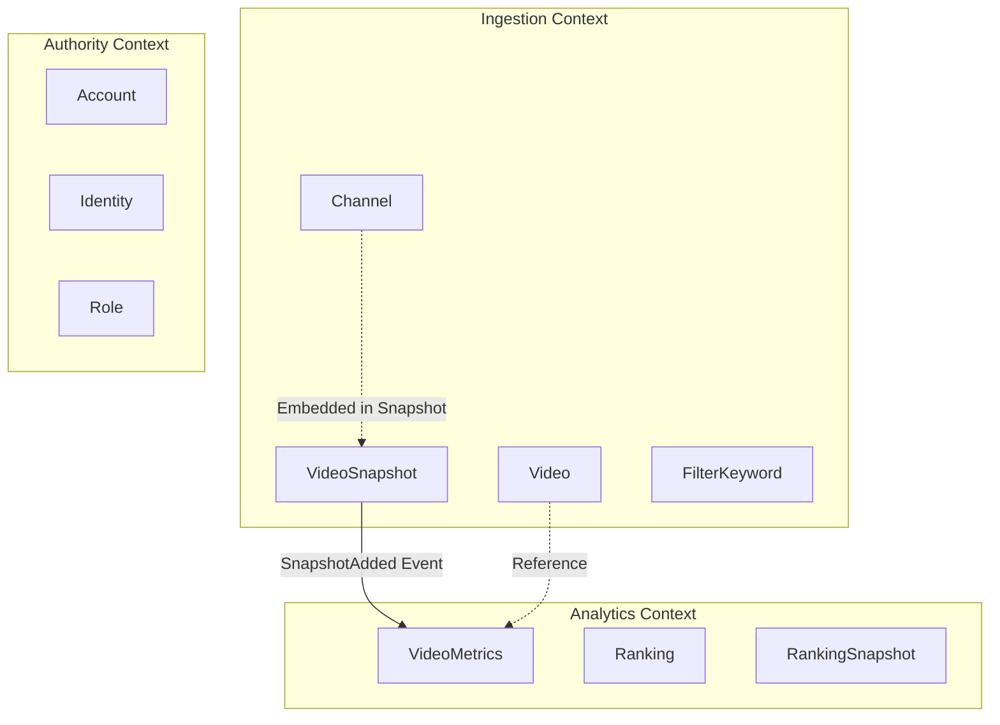

# Bounded Contexts

System boundary definitions in Domain-Driven Design. Each context owns its language and model.

## A) Ingestion (Collection & Storage)

### Purpose
Ingest videos/channels and accurately accumulate their post-publication trajectory

### Key Vocabulary
- Channel
- ChannelSnapshot
- Video
- VideoSnapshot
- FilterKeyword

### External Dependencies
- YouTube Data API v3
- YouTube WebSub Hub

### Representative Behaviors
- Popular collection: Fetch popular videos by category and evaluate with filters
- Filter judgment: Include/exclude by keyword rules on video titles
- Subscription management: Manage channels' WebSub subscription state
- Snapshot storage: Persist measured values at specified times
- Next measurements scheduling: Register tasks per checkpoint

### Data Flow
```
[YouTube API] → [Ingestion] → [Database]
[WebSub Hub] → [Ingestion] → [Cloud Tasks]
```

### Table Responsibilities
- channels
- channel_snapshots
- videos
- video_snapshots
- video_filter_keywords

## B) Analytics (Processing & Serving)

### Purpose
Compute metrics from snapshots, and provide rankings/details and history

### Key Vocabulary
- VideoMetrics
- Ranking
- RankingSnapshot
- Checkpoint
- RankingKind

### Representative Behaviors
- Growth-rate calculation: Rate of increase from 0→X hours
- Metric calculation: Relative views, quality, heat
- Ranking fetch: Sorting and filtering based on conditions
- History persistence: Freeze rankings at a point in time
- Low-sample judgment: Exclude videos with insufficient data

### Calculation Logic

#### Growth Rate
```
view_growth_rate_per_hour = (views@X - views@0) / X[hours]
like_growth_rate_per_hour = (likes@X - likes@0) / X[hours]
```

#### Relative Views
```
views_per_subscription_rate = views@X / subscriptions@X
```

#### Quality (Wilson Lower Bound)
```
wilson_like_rate_lower_bound = WilsonScore(likes@X, views@X, confidence=0.95)
```

#### Heat (LPS)
```
likes_per_subscription_shrunk = (likes@X + OFFSET) / (subscriptions@X + SCALE)
where SCALE=1000, OFFSET=500
```

### Table Responsibilities
- video_metrics_checkpoint
- ranking_snapshots
- ranking_snapshot_items

### Interfaces
- gRPC: ListRanking, GetVideoDetail, ListHistory
- Internal Event: SnapshotAdded → RecomputeMetrics

## C) Authority (Authentication & Authorization)

### Purpose
Sign-in, profile, and role management

### Key Vocabulary
- Account
- Identity
- Role
- Provider (Auth Provider)

### External Dependencies
- Identity Platform (Firebase Auth)
- OIDC Provider
- JWKS Endpoint

### Representative Behaviors
- Token verification: Verify ID tokens and extract claims
- Account creation: Register account at first login
- Profile sync: Sync provider information
- Role judgment: Determine access permissions
- Multi-provider: Link multiple authentication methods

### Auth Flow
```
1. Client → Identity Platform → ID Token
2. ID Token → authority-service → Verification
3. On success → Return account information
```

### Table Responsibilities
- accounts
- identities
- roles (future)

### Invariants
- email is unique among active accounts
- (account_id, provider) is unique
- At least one identity must exist per account
- Deactivated account cannot sign in

## Inter-Context Collaboration

### Principles
- Ingestion → Analytics: Event-driven (SnapshotAdded)
- Analytics ← Ingestion: Read-only (reference Snapshot data)
- Authority: Provides authentication as an independent service

### Data Consistency
- Channel belongs to Ingestion; Analytics uses subscriber counts embedded in snapshots
- Each context owns its database schema
- Avoid cross-context transactions

### Service Split
```
ingestion-service: Implementation of Ingestion Context
analytics-service: Implementation of Analytics Context  
authority-service: Implementation of Authority Context
```

## Context Map


