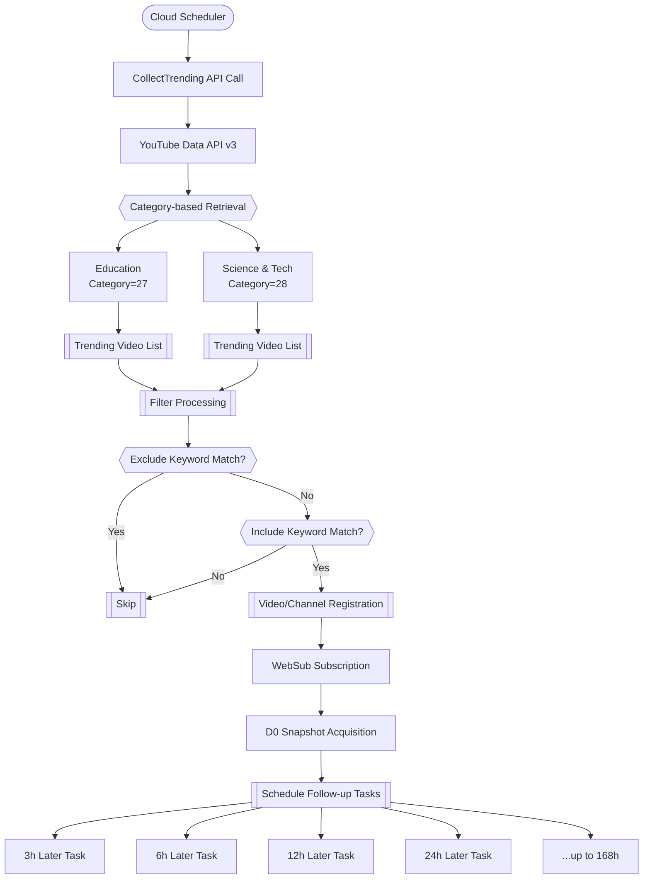
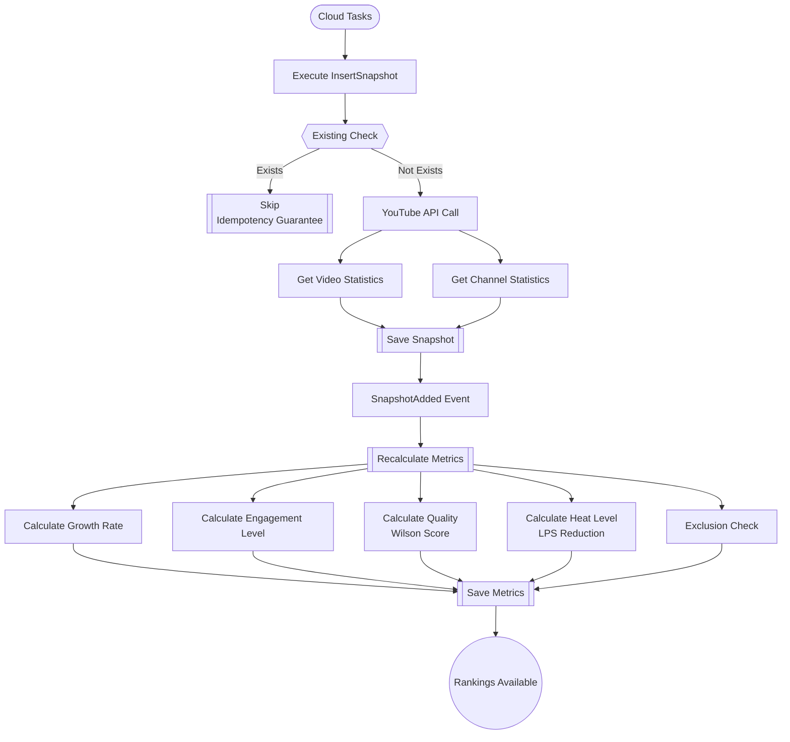
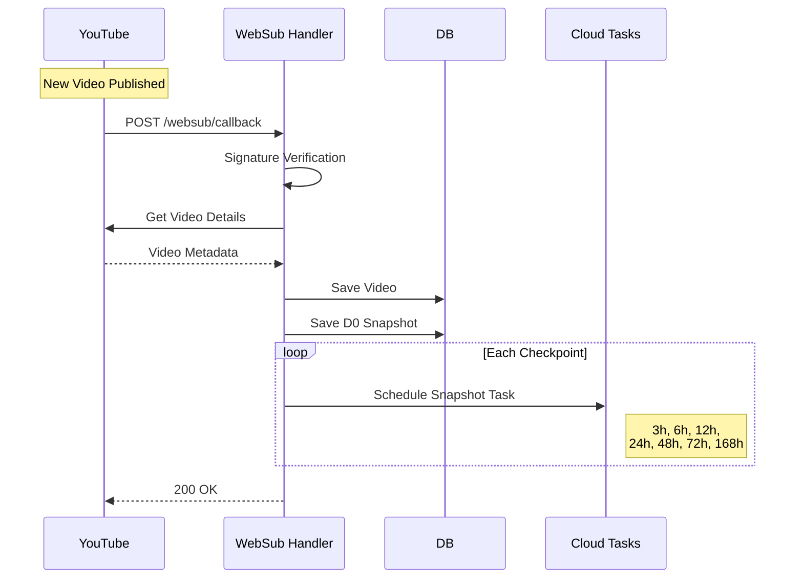
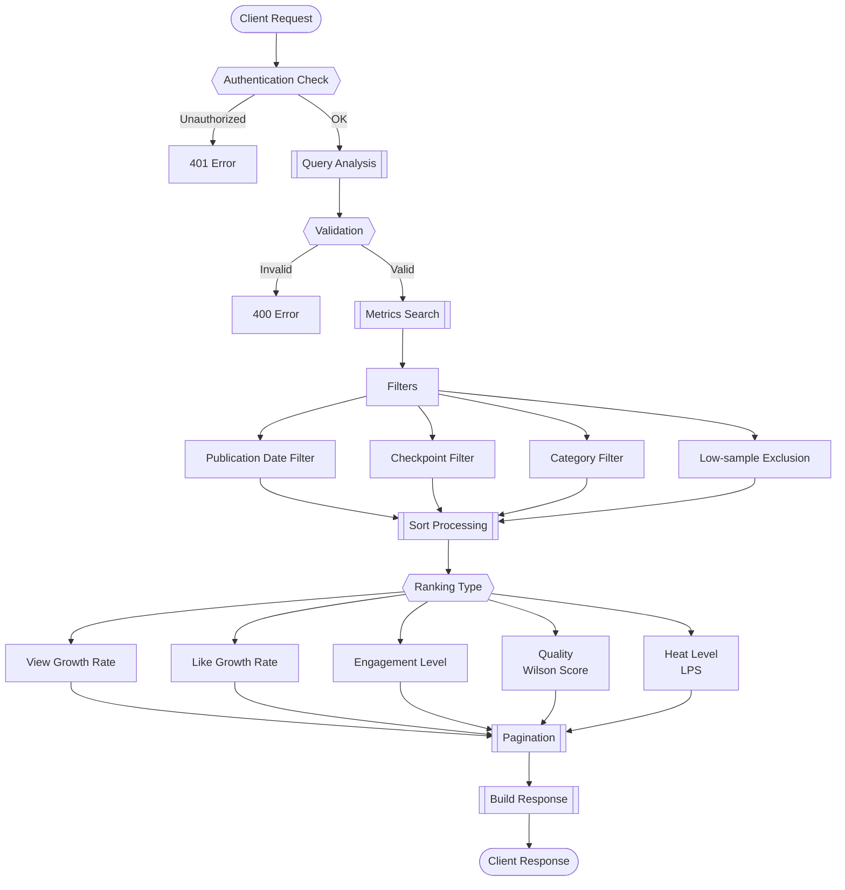
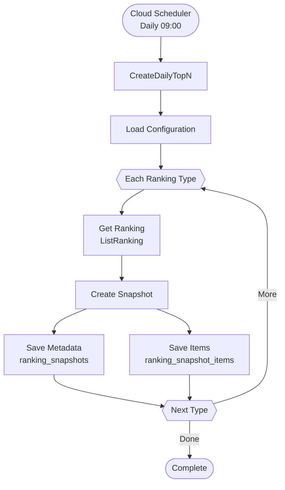
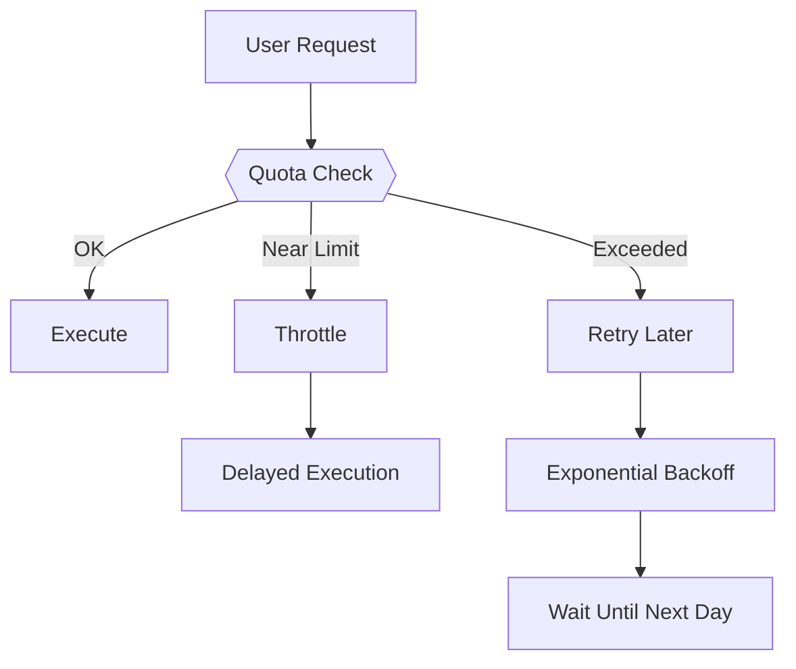
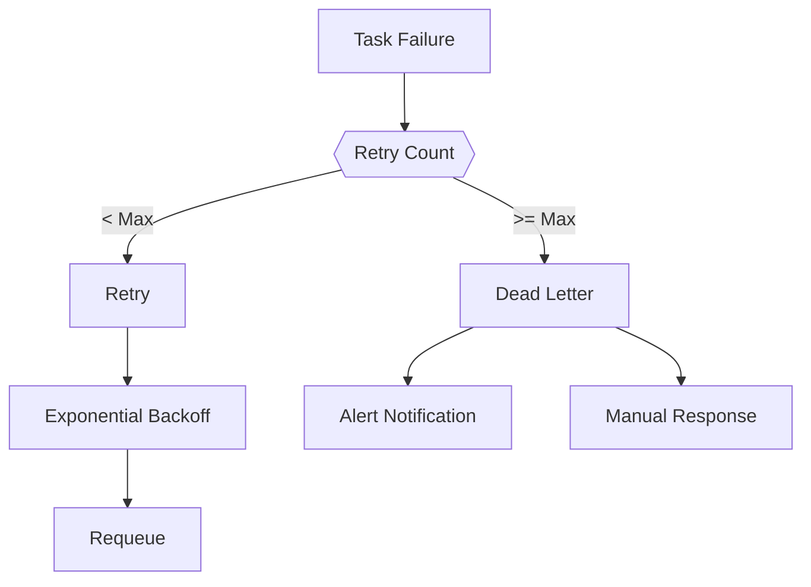

# Representative Flows

System's main data flows and processing sequences.

## 1. Collection → Tracking

### Overview
Flow that collects trending videos, determines inclusion/exclusion via keyword filters, and registers them as monitoring targets.

### Detailed Flow



### Data Flow

1. **Trigger**
   - Cloud Scheduler executes twice daily (03:00, 15:00)
   - Manual execution also possible

2. **Collection**
   - Retrieve trending videos from YouTube Data API for categories 27/28
   - Maximum 200 items per category

3. **Filtering**
   - Evaluate titles with keyword filters
   - Exclusion has priority over inclusion

4. **Registration**
   - Save accepted videos to videos table
   - Save channel information to channels table
   - Enable WebSub subscription

5. **Scheduling**
   - Immediately save D0 (0-hour point) data
   - Register tasks for 3/6/12/24/48/72/168 hours later in Cloud Tasks

## 2. Measurement → Calculation → Provision

### Overview
Flow that takes snapshots at each time point, calculates metrics, and provides rankings.

### Detailed Flow



### Calculation Logic Details

#### Growth Rate Calculation
```
View Growth Rate = (views@X - views@0) / X hours
Like Growth Rate = (likes@X - likes@0) / X hours
```

#### Engagement Level Calculation
```
Views per Subscriber = views@X / subscriptions@X
```

#### Quality Calculation (Wilson Score)
```
p = likes@X / views@X  # Like rate
Wilson Lower Bound = (p + z²/2n - z√(p(1-p)/n + z²/4n²)) / (1 + z²/n)
※ z=1.96 (95% confidence interval)
```

#### Heat Level Calculation (LPS Reduction)
```
LPS = (likes@X + 500) / (subscriptions@X + 1000)
```

#### Exclusion Criteria
| Checkpoint | Minimum Views | Minimum Subscribers |
|------------|---------------|-------------------|
| 3h         | 100          | 100               |
| 6h         | 300          | 100               |
| 12h        | 500          | 100               |
| 24h        | 1000         | 100               |
| 48h        | 2000         | 100               |
| 72h        | 3000         | 100               |
| 168h       | 5000         | 100               |

## 3. WebSub Notification Processing

### Overview
Real-time notification processing when monitored channels publish new videos.

### Detailed Flow



### Processing Steps

1. **Notification Reception**
   - Notification from YouTube Hub via Atom feed
   - Signature verification with HMAC-SHA1

2. **Video Information Acquisition**
   - Extract video_id from notification
   - Get detailed information via YouTube API

3. **D0 Save**
   - Save data immediately after publication (0-hour point)
   - Record as source = "websub"

4. **Schedule Follow-up Tasks**
   - Schedule tasks for each checkpoint
   - Deterministic TaskID generation (prevent duplicates)

## 4. Ranking Provision

### Overview
Flow that provides rankings in response to user requests.

### Detailed Flow



### Request Parameters

| Parameter | Description | Example |
|-----------|-------------|---------|
| published_from | Publication start date | 2024-01-01T00:00:00Z |
| published_to | Publication end date | 2024-01-02T00:00:00Z |
| checkpoint_hour | Checkpoint | 24 |
| ranking_kind | Ranking type | speed_views |
| hide_low_sample | Low-sample exclusion | true |
| category | YouTube category | 27 |
| limit | Number of items to retrieve | 50 |
| offset | Offset | 0 |

## 5. History Preservation

### Overview
Flow that saves ranking top N as snapshots daily at specified times.

### Detailed Flow



### Save Configuration Examples

| Time | Target | Checkpoint | Type | Count |
|------|--------|------------|------|-------|
| 09:00 | Yesterday's published | 24h | All types | Top20 |
| 09:00 | This week's published | 72h | All types | Top50 |
| Monday 09:00 | Last week's published | 168h | All types | Top100 |

## 6. Idempotency Guarantee Mechanisms

### Deterministic TaskID Generation

```go
// Snapshot task ID
taskID = SHA256("snapshot:" + videoID + ":" + checkpointHour)

// Trending task ID
taskID = SHA256("trending:" + category + ":" + timestamp.Truncate(1min))
```

### Database Constraints

```sql
-- Prevent snapshot duplicates
PRIMARY KEY (video_id, checkpoint_hour)

-- Prevent metrics duplicates
PRIMARY KEY (video_id, checkpoint_hour)

-- Prevent account duplicates
UNIQUE (email)
UNIQUE (account_id, provider)
```

### Processing Idempotency

1. **Snapshot Insertion**
   - INSERT after existing check
   - Ignore duplicate errors

2. **Metrics Calculation**
   - UPSERT for overwrite save
   - Same input produces same output

3. **Task Scheduling**
   - Prevent duplicates with deterministic TaskID
   - Utilize Cloud Tasks idempotency guarantee feature

## 7. Error Handling

### API Rate Limiting



### Task Failure



### Data Consistency Errors

| Error Type | Response |
|------------|----------|
| D0 does not exist | Skip metrics calculation |
| Channel does not exist | Retrieve from YouTube API and create |
| Video is deleted | End task |
| API error | Dead letter after retry |
